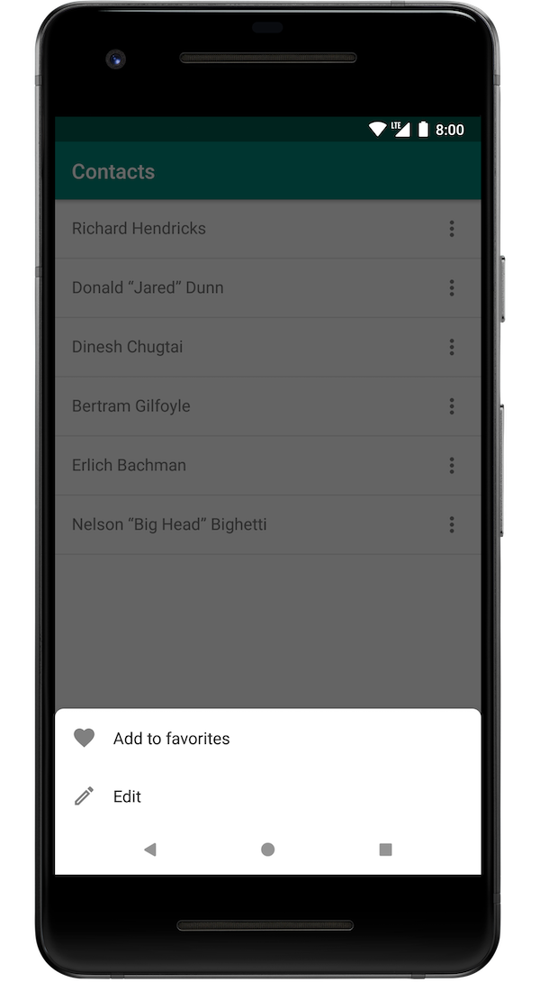

# MaterialBottomDialog

This library provides an implementation of [Material Design’s bottom sheets](https://material.io/design/components/sheets-bottom.html) for use as a dialog.
* Easy-to-use API
* Supports customization via themes
* Optimized for both Java and Kotlin



Usage
---------
1. Add the JitPack repository to your project-level `build.gradle` file and the dependency to your app-level `build.gradle` file.
```groovy
// build.gradle (project-level)
allprojects {
 repositories {
   ...
   maven { url 'https://jitpack.io' }
 }
}

// build.gradle (app-level)
implementation 'com.github.thellmund:MaterialBottomDialog:1.0.2'
```
2. Add these attributes to your theme.
```xml
<style name="AppTheme" parent="Theme.AppCompat.Light.DarkActionBar">
 <!-- Attributes for MaterialBottomDialog -->
 <item name="dialogSheetBackground">@color/defaultWindowBackground</item>
 <item name="dialogSheetTintColor">@color/defaultTextColor</item>
 <item name="dialogSheetCornerRadius">@dimen/cornerRadius</item>
 <item name="dialogSheetLightNavigationBar">true</item>
</style>
```

3. Use it in your app.
```kotlin
val actions = listOf(
  EnabledAction("Option 1"),
  DisabledAction("Option 2")
)

MaterialBottomDialog.make(this)
  .with(actions)
  .onSelected { /* ... */ }
  .onDismiss { /* ... */ }
  .show()
```

Actionable
---------

Optional: You can implement `Actionable` on data objects on which users can perform actions.
```kotlin
// Contact.kt
data class Contact(val firstName: String, val lastName: String) : Actionable {
  override fun getActions(): List<Action> {
    return listOf(
      EnabledAction("Add to favorites", R.drawable.ic_favorite),
      EnabledAction("Edit", R.drawable.ic_edit)
    )
  }
}

// MainActivity.kt
val contact = Contact("Richard", "Hendricks")
MaterialBottomDialog.make(this)
  .with(contact)
  .onSelected { /* ... */ }
  .onDismiss { /* ... */ }
  .show()
```
